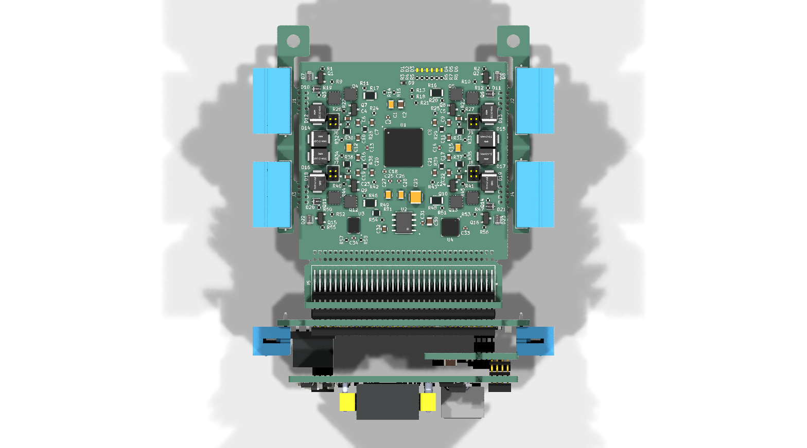
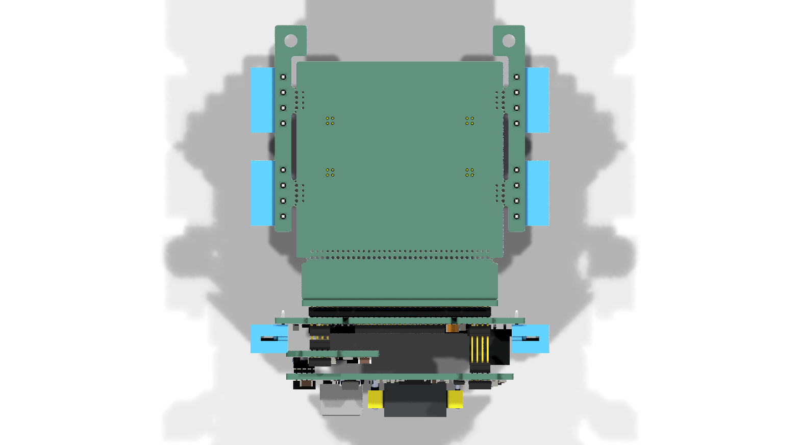
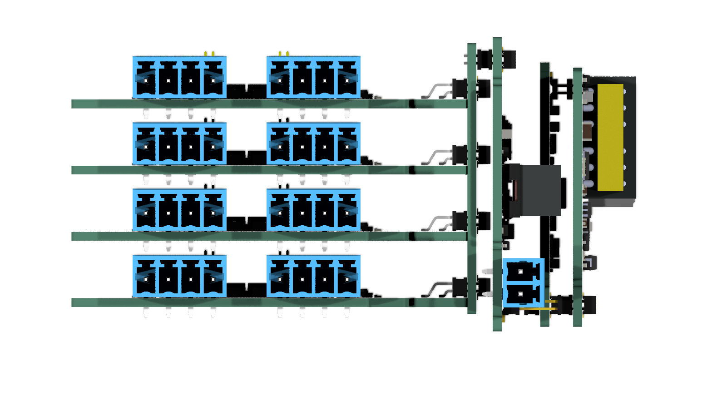

# Modular_AD74416H_PLC

## Overview

This repository contains a modular KiCad design project for a PLC based on the Analog Devices AD74416H, a quad-channel, software-configurable input and output device with HART modem capabilities. The project includes schematic designs and PCB layout files for implementing this versatile analog I/O device in a modular fashion, with a separate power interface module.

## Disclaimer

> [!NOTE]
> This project is provided "as is" and without any warranty, express or implied. For more details, please see the [LICENSE](LICENSE) file.

## About the AD74416H

The AD74416H from Analog Devices is a quad-channel, software-configurable input/output solution for building and process control applications. It integrates a 24-bit, sigma-delta (Σ-Δ) analog-to-digital converter (ADC) and four 16-bit digital-to-analog converters (DACs).

Key features include:

- **Software-Configurable Channels:** Each of the four channels can be independently configured as:
  - Analog Input (Voltage or Current)
  - Analog Output (Voltage or Current)
  - Digital Input
  - Digital Output
  - 2- or 3-wire Resistance Temperature Detector (RTD) and Thermocouple measurements
- **HART Compatibility:** Each channel has an integrated HART (Highway Addressable Remote Transducer) modem.
- **Integrated Converters:** The device includes a 16-bit digital-to-analog converter (DAC) per channel and a single 24-bit sigma-delta (Σ-Δ) analog-to-digital converter (ADC).
- **Communication:** All input, output, and HART communications for the four channels are handled through a single SPI-compatible interface. It is possible to address up to four AD74416H devices on a single SPI bus.
- **Power Efficiency:** It features adaptive power switching, which can lower power dissipation by up to 40%.
- **Robustness and Diagnostics:** Features on-chip diagnostics like open-circuit and short-circuit detection and an internal temperature sensor.
- **Operating Temperature Range:** -40°C to +105°C.
- **Package:** Available in a 64-lead LFCSP package.

## Project Structure

```
modular_ad74416h_plc/
├── modular_ad74416h_plc.kicad_pro               # Project configuration file
├── modular_ad74416h_plc.kicad_sch               # Main schematic file
├── modular_ad74416h_plc.kicad_pcb               # PCB layout file
├── fp-lib-table                                 # Footprint library table
├── sym-lib-table                                # Symbol library table
├── docs/                                        # Documentation files
│   ├── bom/                                     # Bill of Materials
│   │   └── modular_ad74416h_plc_ibom.html       # Interactive BOM file
│   ├── pictures/                                # Images and photos
│   │   ├── 1_modular_ad74416h_plc_side.png
│   │   ├── 2_modular_ad74416h_plc_top.png
│   │   ├── 3_modular_ad74416h_plc_bottom.png
│   │   ├── 4_modular_ad74416h_plc_left.png
│   │   └── 5_modular_ad74416h_plc_right.png
│   └── schematics/                              # Schematic PDF exports
│       └── modular_ad74416h_plc_schematics.pdf
└── KiCAD_Symbols_Generator/                     # Submodule for symbol generation from CSV data
```

## Project Features

This design provides a modular implementation of a PLC based on the AD74416H, featuring:

- **Modular Design:** Utilizes multiple `MINIMAL_AD74416H` modules, allowing for scalable channel count.
- **Power Interface Module:** A dedicated module (`AD74416H_POWER_INTERFACE_MODULE`) for power distribution and management.
- **Scalability:** The design can be easily expanded by adding more `MINIMAL_AD74416H` modules.
- **HART Communication:** Each channel supports HART communication.
- **Standardized Modules:** The use of standardized modules simplifies assembly and maintenance.

## Getting Started

### Prerequisites

- [KiCad EDA](https://www.kicad.org/) version 9.0 or later installed on your system
- Git (for cloning the repository and submodule management)

### Opening the Project

1. **Clone the repository** (including submodules):
   ```bash
   git clone --recursive https://github.com/ionutms/Modular_AD74416H_PLC.git
   ```
   
   If you've already cloned the repository without submodules, initialize them with:
   ```bash
   git submodule init
   git submodule update
   ```

2. **Open the project in KiCad**:
   - Launch KiCad
   - Click "Open Existing Project"
   - Navigate to the cloned repository folder
   - Select the `modular_ad74416h_plc.kicad_pro` file

3. **Explore the design**:
   - Open the schematic editor to view the circuit design
   - Open the PCB editor to view the board layout
   - Review the symbol and footprint libraries used in the design

### Project Files

- **Main schematic**: `modular_ad74416h_plc.kicad_sch` - Contains the primary circuit design with the AD74416H and support components
- **PCB layout**: `modular_ad74416h_plc.kicad_pcb` - Physical board design file with proper component placement
- **Project configuration**: `modular_ad74416h_plc.kicad_pro` - KiCad project settings

## Dependencies

This project has the following dependencies:

### 1. KiCAD Symbols Generator

This repository uses [KiCAD_Symbols_Generator](https://github.com/ionutms/KiCAD_Symbols_Generator) as a submodule for custom symbol generation.

To initialize the submodule after cloning this repository:

```bash
git submodule update --init --recursive
```

### 2. 3D Models

This project requires the [3D_Models_Vault](https://github.com/ionutms/3D_Models_Vault) repository for 3D models.

#### Setup for KiCAD 9:

1. Clone the 3D models repository:
   ```bash
   git clone https://github.com/ionutms/3D_Models_Vault.git
   ```

2. In KiCAD 9, add an environment variable:
   - Variable name: `KICAD9_3D_MODELS_VAULT`
   - Variable value: Full path to where you cloned the 3D_Models_Vault repository

## Usage

After setting up the dependencies, open the project in KiCad 9 to access all features including the 3D models.

## Symbol Generator Submodule

This project includes the KiCAD_Symbols_Generator as a submodule, which provides tools for generating KiCad symbols from CSV data files. For more information on using this tool, see the [KiCAD_Symbols_Generator documentation](modular_ad74416h_plc/KiCAD_Symbols_Generator/README.md).

## Documentation

The `docs` folder contains:
- Schematic PDF exports
- Images and photos of the design

## Visuals

The following images showcase the PCB design from different perspectives:


*Top View of the PCB*


*Side View of the PCB*


*Bottom View of the PCB*


*Left View of the PCB*


*Right View of the PCB*

## License

This project is licensed under the MIT License - see the [LICENSE](LICENSE) file for details.

## References

- [AD74416H Datasheet](https://www.analog.com/media/en/technical-documentation/data-sheets/ad74416h.pdf)
- [KiCad EDA](https://www.kicad.org/)
